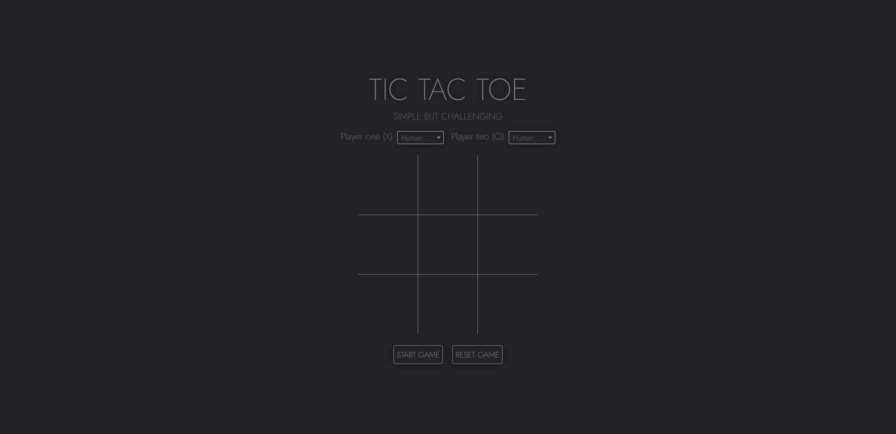
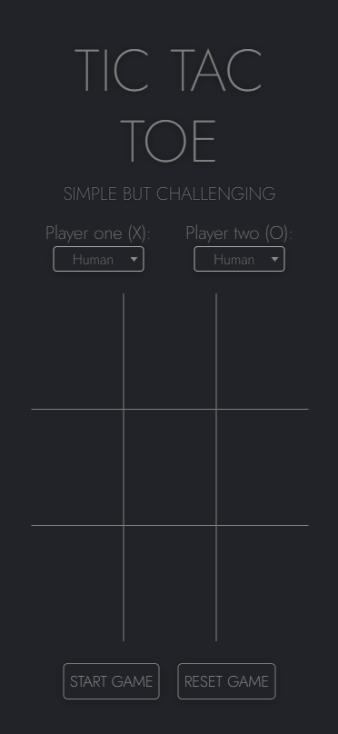

<h1 align="center">
  IMPLEMENTATION OF THE MINIMAX ALGORITHM IN TIC TAC TOE
</h1>

## 👨‍💻 Technologies

- [jQuery]

## 🔧 Resources
* TIC TAC TOE with AI mode.

## ❓ How to use?

### Execution

```bash
$ cd TIC-TAC-TOE
$ open ./index.html
```

## 💻 Web View

<h1 align="center">
    
</h1>

## 📱 Mobile View

<h1 align="center">
    
</h1>

<p align="center">
Created by Bruno Lemos.
</p>
